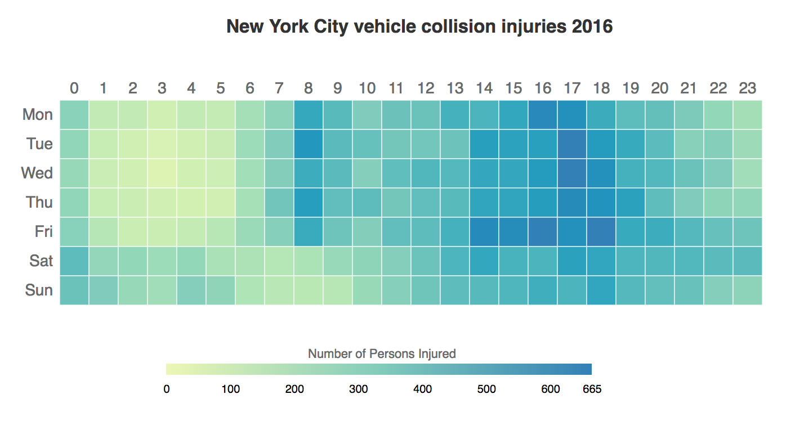
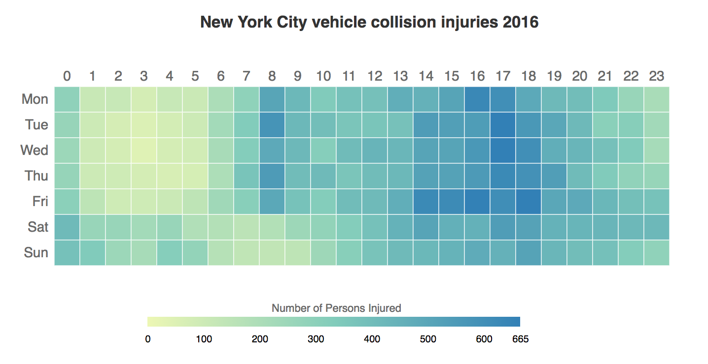

# 09-using-color-with-d3
Module 9: Exploring ways to use and manipulate color with D3

We'll be making a "heatmap" showing the density of vehicle collisions in NYC by hour and day of the week for all of 2016. To accomplish this, we'll take a look at various ways of using d3's built in methods of applying color to our viz, using color spaces, and how to work with color manipulation methods such as color blending and color gradients. Inspiration will be taken from Nadieh Bremer's SVG Beyond Mere Shapes [talk](https://youtu.be/AwlA3SaChHE) and [tutorials](https://www.visualcinnamon.com/tag/svg-beyond-mere-shapes), which you should _definitely checkout!_

Both these images use the same **color scale**, but use different **color spaces**. _Can you spot the difference between them?_

## Resources:
- CSS "isolation" property: https://developer.mozilla.org/en-US/docs/Web/CSS/isolation
- CSS "mix-blend-mode" property: https://developer.mozilla.org/en-US/docs/Web/CSS/mix-blend-mode

- d3-scale-chromatic: https://github.com/d3/d3-scale-chromatic
- d3-color: https://github.com/d3/d3-color
- d3-interpolate color spaces: https://github.com/d3/d3-interpolate#color-spaces
